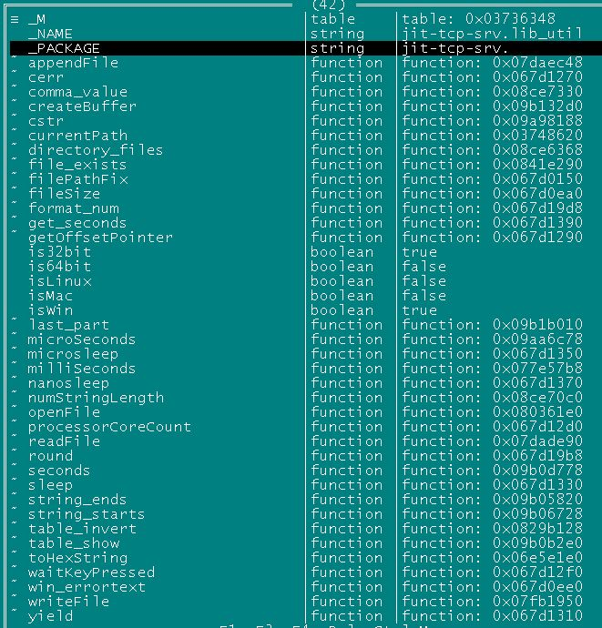

# lua-jit-tcp-srv
create "jit-tcp-srv" directory in modules directory to keep this files.  
Репозиторий не рабочий без разкомментирования: 
--[[ local ffi = require "ffi" --]]  
.. т.к. у меня ФФИ  сидит в глобале,  
и там еще кое-что я правил, что у других работать не будет. 

run: 
lua:LE(require("jit-tcp-srv.lib_util")) 

